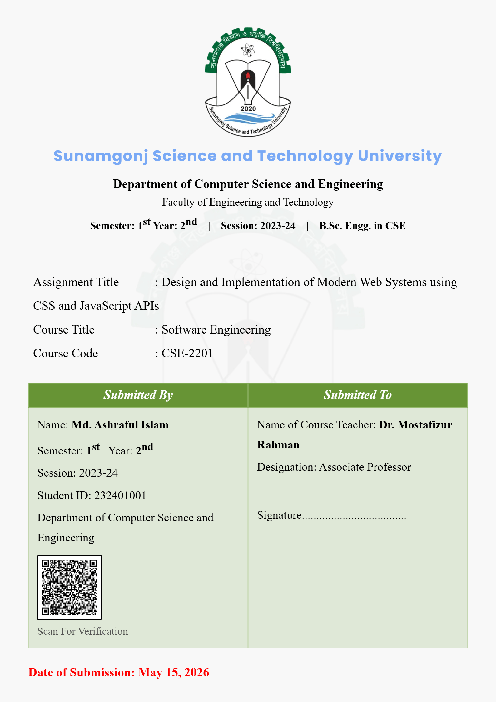

# 📄 Premium Cover Page Generator (SSTU)

A fully responsive, premium web application to generate professional assignment/lab cover pages tailored for **Sunamgonj Science and Technology University** (or adaptable to any institution).

  

### 🚀 Key Features
- ✨ **Live Dynamic Preview:** Watch your changes instantly as you type.
- 🎯 **Precise A4 Dimensioning:** Optimized single-page constraint ensures design zero-breakage.
- 📱 **Perfectly Responsive:** Auto-scaling viewports fit desktop and mobile perfectly.
- 🛡️ **Integrated QR Code:** Generates custom, detailed student verifications dynamic scanning data.
- 🎨 **Modern Aesthetics:** Highly optimized PDF rendering engine (2x pixel density).

---

## 🛠️ Technologies Used

---

# 👋 Author Profile

## **MASUDUL HASAN**
> *"❌ মিথ্যা একটি রোগ এবং সত্যবাদিতা একটি নিরাময়‼️ 👋 Lying is a disease and truthfulness is a cure. 🌸☘️"*

🔭 I’m currently studying on **Sunamgonj Science and Technology University - Department of CSE**  
🌱 I’m currently learning **HTML, CSS & C++**  
👨‍💻 All of my projects are available at [github.com/masudul2002](https://github.com/masudul2002)  
📝 I regularly write articles on [masudulhasan.me](https://www.masudulhasan.me)  
📫 How to reach me: **23240442@sstu.ac.bd**  
📄 Know about my experiences [linkedin.com/in/masudul2002](https://www.linkedin.com/in/masudul2002)

### 🤝 Connect with me

### 🧰 Languages and Tools

 
 
 
 
 
 
 
 
 
 
 
 
 

---

### 📜 License
Licensed under the [MIT License](LICENSE). Created by **masudul2002**.
